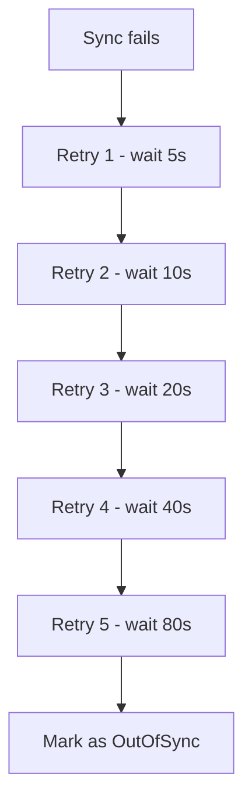
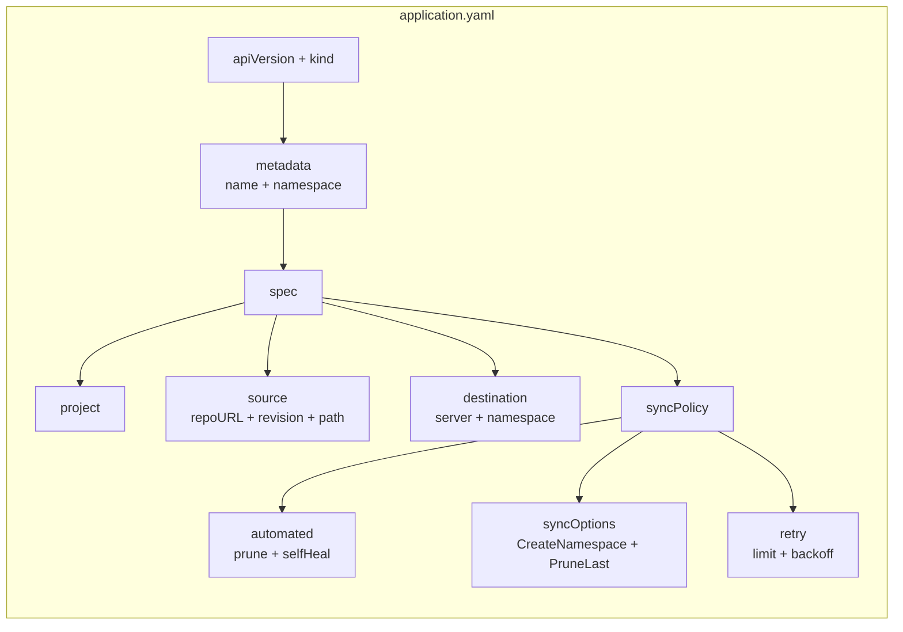

# ArgoCD Application — Messageboard

This folder contains an **ArgoCD Application** definition. Think of it as a set of instructions that tells ArgoCD: *"Hey, please deploy and manage this app for me!"*

## What is ArgoCD?

ArgoCD is a **GitOps** tool. "GitOps" means your Git repository is the single source of truth — whatever is in Git is what should be running on your Kubernetes cluster. If somebody changes something in the cluster manually, ArgoCD will notice and revert it back to match Git. If you push changes to Git, ArgoCD will apply them automatically.


## What does this file do?

This `application.yaml` defines one ArgoCD Application named **`messageboard`**. Here's what each part means, explained simply:

### Top-level fields

```yaml
apiVersion: argoproj.io/v1alpha1
kind: Application
```

- **apiVersion** — The version of the ArgoCD API this resource uses. `argoproj.io/v1alpha1` is the standard one. Think of it like a "file format version" — it tells Kubernetes how to read this file.
- **kind** — What type of resource this is. `Application` is ArgoCD's way of saying "this is an app I need to manage".

### Metadata (who is this?)

```yaml
metadata:
  name: messageboard
  namespace: argocd
```

- **name** — The name of this Application in ArgoCD — `messageboard`.
- **namespace** — The Kubernetes namespace where this Application resource lives. It's stored in the `argocd` namespace because ArgoCD watches that namespace for Applications to manage.

### Project (which project does it belong to?)

```yaml
spec:
  project: default
```

- **project** — A way to group Applications together in ArgoCD. `default` is a built-in project that allows everything. You can create your own projects to control who can deploy where (RBAC), but for a simple setup, `default` works fine.

### Source (where is the code?)

```yaml
source:
  repoURL: REPLACE_ME
  targetRevision: HEAD
  path: kubernetes
```

- **repoURL** — The Git repository URL (you need to replace `REPLACE_ME` with your actual repo URL).
- **targetRevision** — Which branch/tag to follow. `HEAD` means the latest commit on the default branch.
- **path** — Which folder inside the repo contains the Kubernetes YAML files. Here it's the `kubernetes/` folder.

So ArgoCD will look at `https://your-repo.git/kubernetes/` and apply everything in there.

### Destination (where to deploy?)

```yaml
destination:
  server: https://kubernetes.default.svc
  namespace: messageboard
```

- **server** — The Kubernetes cluster to deploy to. This is the internal address of the same cluster ArgoCD runs on.
- **namespace** — Deploy everything into the `messageboard` namespace. If it doesn't exist yet, don't worry — see below.

### Sync Policy (how to deploy?)

```yaml
syncPolicy:
  automated:
    prune: true
    selfHeal: true
  syncOptions:
    - CreateNamespace=true
    - PruneLast=true
  retry:
    limit: 5
    backoff:
      duration: 5s
      factor: 2
      maxDuration: 3m
```

#### `automated`

Tells ArgoCD to sync automatically when it sees changes in Git. No manual "Sync" button clicks needed.

- **`prune: true`** — If you delete a file from Git, ArgoCD will **delete** that resource from the cluster too. Without this, deleting from Git would just leave the old resource running forever.
- **`selfHeal: true`** — If someone manually edits or deletes something in the cluster (e.g. `kubectl delete pod ...`), ArgoCD will **fix it back** to match Git. This prevents "configuration drift" — where the cluster slowly gets out of sync with what's committed.

#### `syncOptions`

Extra flags that fine-tune how syncing works:

- **`CreateNamespace=true`** — Automatically creates the `messageboard` namespace if it doesn't exist yet. Without this, the sync would fail if the namespace is missing.
- **`PruneLast=true`** — When deleting old resources (because you removed them from Git), delete them **after** applying new ones. This reduces downtime — the new stuff comes up before the old stuff goes away.

#### `retry`

```yaml
retry:
  limit: 5          # try up to 5 times
  backoff:
    duration: 5s    # wait 5 seconds before first retry
    factor: 2       # double the wait each time (5s → 10s → 20s → ...)
    maxDuration: 3m # but never wait more than 3 minutes between retries
```

If a sync fails (e.g. the Git repo is temporarily down), ArgoCD will retry. It uses **exponential backoff** — each retry waits longer than the last, so it doesn't hammer your cluster or Git provider. If all 5 retries fail, it gives up and marks the Application as "OutOfSync".



### Full structure overview



## How to use it

1. **Replace the repo URL** — change `REPLACE_ME` to your actual Git repo URL (e.g. `https://github.com/yourname/messageboard.git`).
2. **Make sure your Kubernetes manifests exist** in the `kubernetes/` folder of that repo.
3. **Apply this file** to your cluster:
   ```bash
   kubectl apply -f application.yaml
   ```
4. ArgoCD will pick it up and start deploying!

## What do I need to use this?

You need **three things** installed and running:

### 1. A Kubernetes cluster

This is where your app will actually run. Options:
- **Minikube** — a local Kubernetes cluster on your laptop (great for testing)
- **Kind** — Kubernetes IN Docker, another lightweight local option
- **A cloud cluster** — EKS (AWS), AKS (Azure), GKE (Google), or any other

### 2. `kubectl`

The command-line tool for talking to Kubernetes. You use it to apply this `application.yaml` file to the cluster.

### 3. ArgoCD installed on the cluster

ArgoCD itself needs to be deployed inside your Kubernetes cluster before it can manage apps. There are two ways to install it:

#### Option A — Install ArgoCD manually

```bash
kubectl create namespace argocd
kubectl apply -n argocd -f https://raw.githubusercontent.com/argoproj/argo-cd/stable/manifests/install.yaml
```

Then get the admin password and log in via the ArgoCD UI or `argocd` CLI.

#### Option B — Use the `argocd` CLI

```bash
# macOS
brew install argocd

# Linux
curl -sSL -o /usr/local/bin/argocd https://github.com/argoproj/argo-cd/releases/latest/download/argocd-linux-amd64
chmod +x /usr/local/bin/argocd
```

### 4. (Optional) A Git repo with your Kubernetes manifests

This `application.yaml` points to a Git repo's `kubernetes/` folder. That repo must contain valid Kubernetes YAML files (Deployments, Services, etc.).


### Summary checklist

| What | Why you need it |
|---|---|
| Kubernetes cluster | Where everything runs |
| `kubectl` | To apply `application.yaml` and talk to the cluster |
| ArgoCD installed on the cluster | It reads this file and does the actual syncing |
| A Git repo with `kubernetes/` folder | Contains your actual app manifests (Deployment, Service, etc.) |

If you have all four, you're ready to go!
