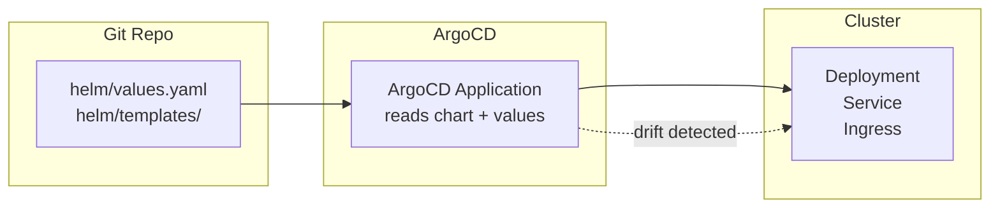

# Helm vs ArgoCD — what goes where?

**Helm** and **ArgoCD** sound similar (they both deploy stuff to Kubernetes), but they solve different problems. Here's how they fit together in this Messageboard project.

## The short version

| Tool | What it does | Analogy |
|---|---|---|
| **Helm** | Packages Kubernetes YAML into a reusable template with configurable values | A **.deb/.rpm package installer** — it installs a thing with your chosen options |
| **ArgoCD** | Watches a Git repo and keeps the cluster in sync with what's in Git | A **CI/CD pipeline** that runs forever and auto-fixes drift |

You don't pick one **or** the other — you use **both together**.

## What each does for this project

### Helm — the packaging layer

The `helm/` folder turns the raw Kubernetes manifests (`kubernetes/deployment.yaml`, `service.yaml`, `ingress.yaml`) into a **parameterized chart**. Instead of editing YAML files directly to change the image tag, DB host, or replica count, you change `values.yaml`:

```yaml
# Before (raw YAML) — hardcoded
image: 127.0.0.1:5000/simple_messageboard:latest
DB_HOST: my-db-mariadb
replicas: 1

# After (Helm values.yaml) — configurable
image:
  repository: 127.0.0.1:5000/simple_messageboard
  tag: latest
db:
  host: my-db-mariadb
replicaCount: 1
```

**Use Helm when:**
- You want to install the app with different settings per environment (`helm install ... -f values-prod.yaml`)
- You want to **reuse** the same chart across dev/staging/prod with different values
- You need to **package** your app so others can install it easily
- You want to manage upgrades with `helm upgrade` and rollback with `helm rollback`

### ArgoCD — the GitOps layer

The `argocd/application.yaml` tells ArgoCD: *"Watch this Git repo, and keep the cluster in sync."* ArgoCD doesn't care if the repo contains raw YAML or a Helm chart — it just syncs whatever is in there.

**Use ArgoCD when:**
- You want **automated deployment** — push to Git, and the cluster updates itself
- You want **drift detection** — someone `kubectl delete`'d a pod? ArgoCD brings it back
- You want a **web UI** showing what's deployed and whether it matches Git
- You manage **multiple apps** across **multiple clusters** from one place

## How they work together

ArgoCD can **natively render Helm charts** — it runs `helm template` internally. So your Git repo can contain a Helm chart, and ArgoCD will install it with the values you specify in the ArgoCD Application.



### Example: ArgoCD pointing to the Helm chart

Instead of `path: kubernetes`, you'd set:

```yaml
source:
  path: helm
  helm:
    valueFiles:
      - values.yaml
```

Now ArgoCD will:
1. Pull the Git repo
2. Run `helm template` on the `helm/` folder
3. Apply the resulting manifests to the cluster
4. Keep watching for changes

## Decision flow

```
Do you need to install the app once with custom settings?
    │
    ├── Yes, and I'll manage updates manually → use Helm directly
    │    (helm install / helm upgrade)
    │
    ├── Yes, and I want auto-sync + drift protection → use Helm + ArgoCD
    │    (Helm packages it, ArgoCD keeps it running)
    │
    └── No, my YAML is simple and static → just use ArgoCD with raw YAML
         (point path: kubernetes directly)
```

## In this project specifically

| Layer | What's here | Why |
|---|---|---|
| `kubernetes/` | Raw Deployment, Service, Ingress YAML | The original manifests — source of truth before Helm |
| `helm/` | Parameterized chart with `values.yaml` | Lets you configure image, DB, replicas, etc. without editing templates |
| `argocd/` | ArgoCD Application definition | Watches the repo and auto-deploys; also handles self-healing |

**Typical workflow:**

1. Dev edits code → pushes to Git
2. CI builds a Docker image with a new tag
3. Dev updates `helm/values.yaml` with the new tag (or CI does it)
4. ArgoCD detects the change in Git → syncs to the cluster
5. If someone manually breaks something → ArgoCD self-heals

## When to skip each

**Skip Helm if** your app has 1–2 manifests with no variance between environments. Just use raw YAML in `kubernetes/`.

**Skip ArgoCD if** you're running a single-node test cluster and just want to `kubectl apply` once. ArgoCD adds complexity for no benefit at that scale.

**Use both** when you need repeatable deployments + automated GitOps in a team setting.
