# Kubernetes Network Flow — Step by Step

## Step 0: Pod Basics

A Pod is the smallest deployable unit — one or more containers sharing a network stack (IP, port space).

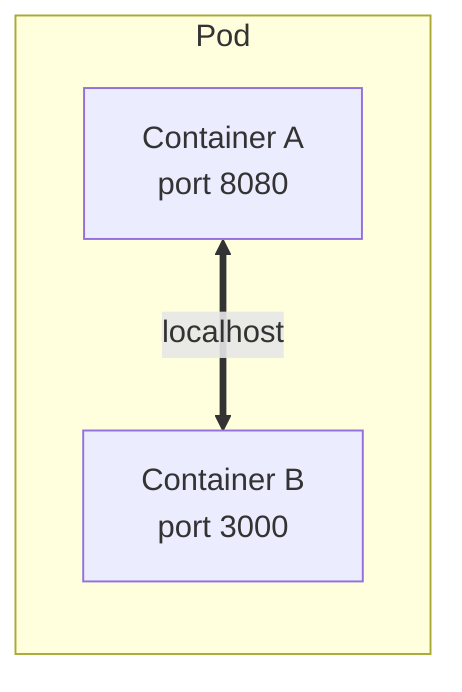

Containers inside the same Pod communicate via `localhost`.

## Step 1: Pod-to-Pod (Same Node)

Each Pod gets a unique cluster IP. On the same node, traffic flows through the CNI bridge.

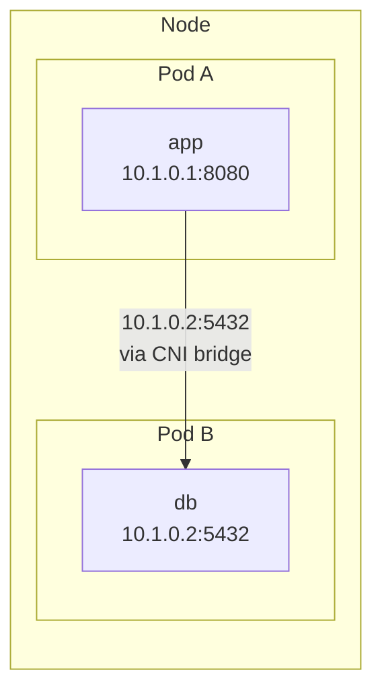

## Step 2: Pod-to-Pod (Different Nodes)

Across nodes, traffic goes through the CNI overlay network (e.g. Calico, Flannel, Cilium).

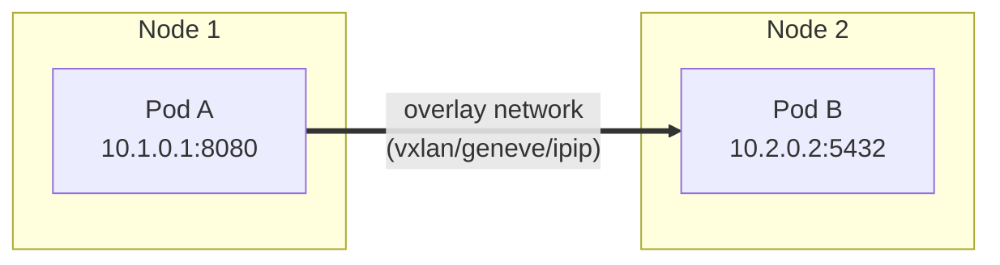

**Problem**: Pod IPs are ephemeral. If Pod A dies and recreates on Node 2, Pod B's hardcoded IP breaks.

## Step 3: Service (ClusterIP) — Stable Internal Name

A Service gives a stable virtual IP and DNS name, load-balancing across Pods.

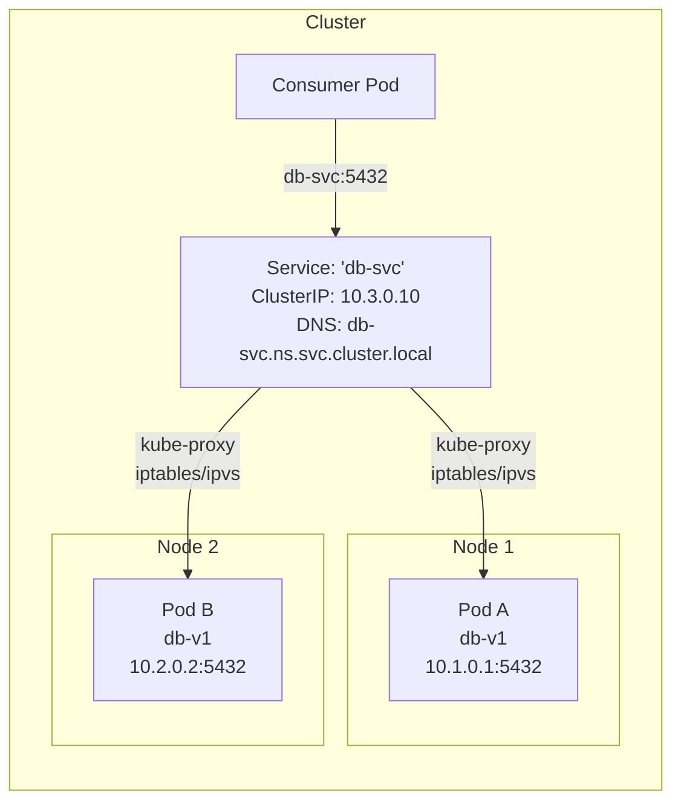

### What happens when you `curl db-svc:5432`:

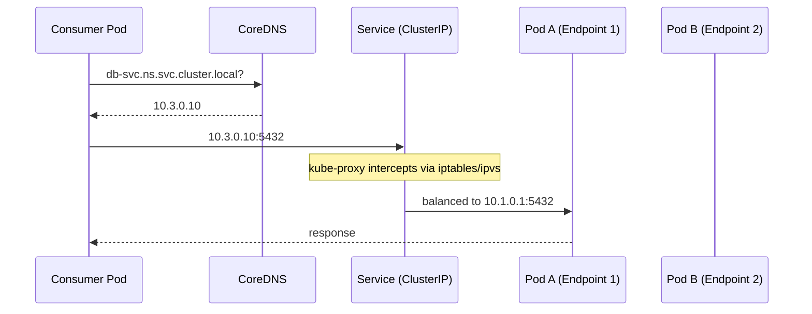

```yaml
apiVersion: v1
kind: Service
metadata:
  name: db-svc
spec:
  type: ClusterIP
  selector:
    app: db
  ports:
    - port: 5432
      targetPort: 5432
```

**Reachability**: cluster-internal only. No external access.

## Step 4: NodePort — Open a Port on Every Node

NodePort maps a high port (30000-32767) on every node to the Service.

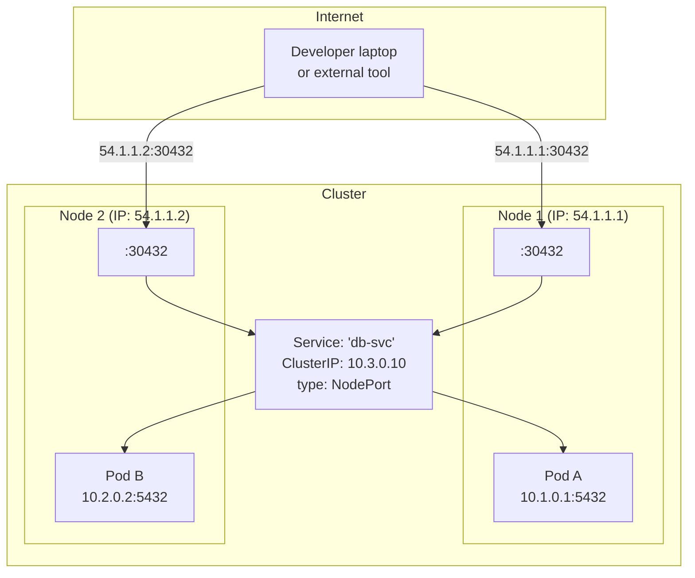

```yaml
apiVersion: v1
kind: Service
metadata:
  name: db-svc
spec:
  type: NodePort
  selector:
    app: db
  ports:
    - port: 5432
      targetPort: 5432
      nodePort: 30432
```

**Problem**: You must know a node IP and manage firewall rules. No load-balancing across nodes. Node port range is limited.

## Step 5: LoadBalancer — Cloud LB in Front

Cloud providers automatically provision a load balancer that forwards to NodePort on all nodes.

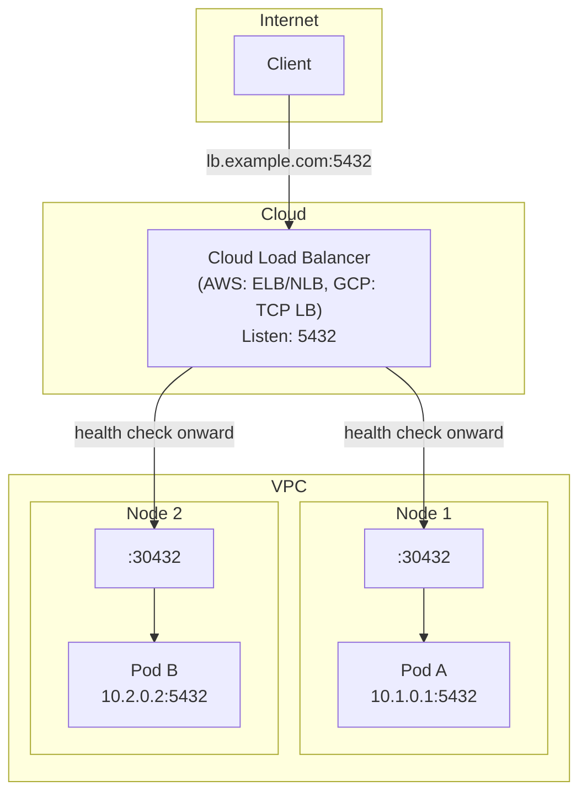

```yaml
apiVersion: v1
kind: Service
metadata:
  name: db-svc
  annotations:
    service.beta.kubernetes.io/aws-load-balancer-type: external
    service.beta.kubernetes.io/aws-load-balancer-scheme: internet-facing
spec:
  type: LoadBalancer
  selector:
    app: db
  ports:
    - port: 5432
      targetPort: 5432
```

**Flow**: `Client → LB DNS → Cloud LB → :NodePort on any healthy node → Pod`.

**Problem**: One LB per service = expensive. No L7 routing (host/path/TLS).

## Step 6: Ingress — L7 Routing to Multiple Services

One Ingress Controller handles TLS termination, path-based routing, and host-based routing for many Services.

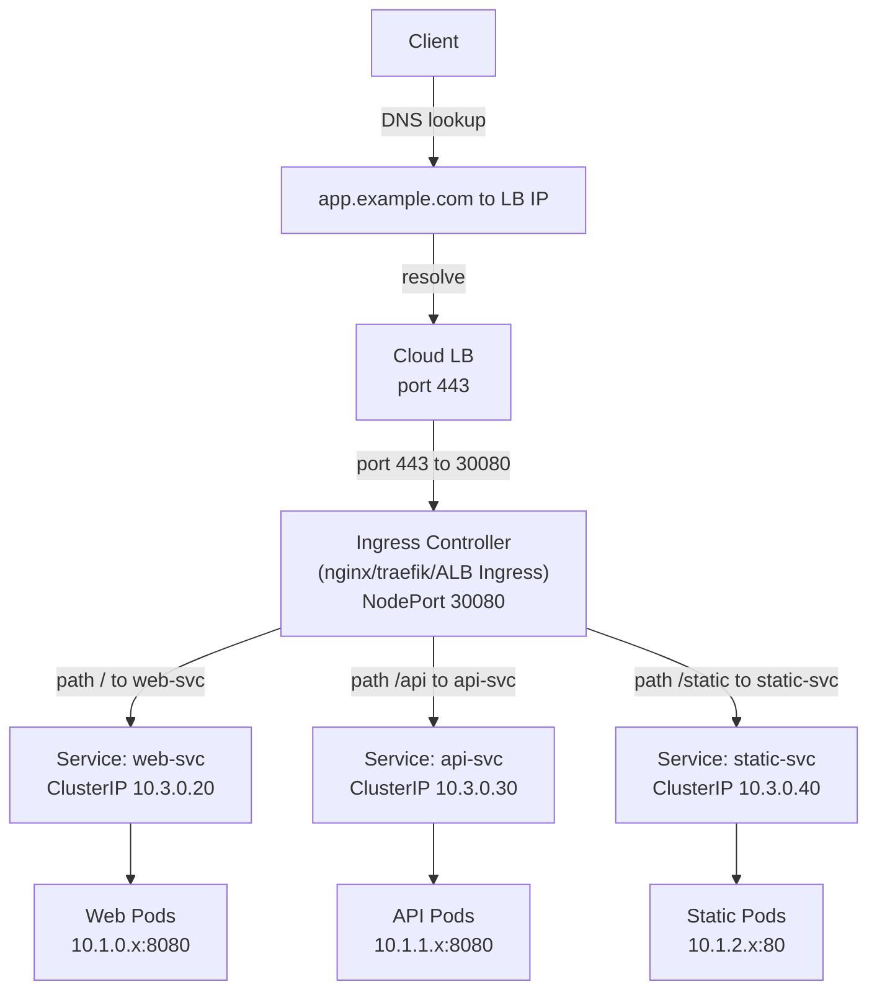

### Ingress routing decision:

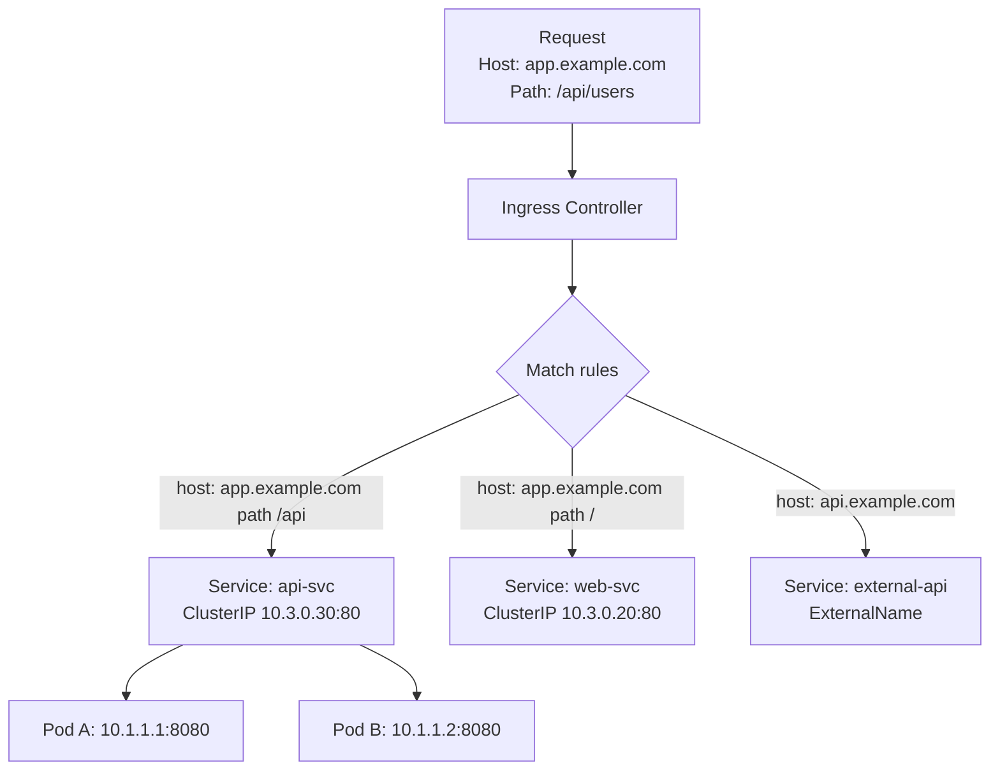

```yaml
apiVersion: networking.k8s.io/v1
kind: Ingress
metadata:
  name: app-ingress
  annotations:
    nginx.ingress.kubernetes.io/rewrite-target: /
    nginx.ingress.kubernetes.io/ssl-redirect: "true"
spec:
  ingressClassName: nginx
  tls:
    - hosts:
        - app.example.com
      secretName: app-tls
  rules:
    - host: app.example.com
      http:
        paths:
          - path: /
            pathType: Prefix
            backend:
              service:
                name: web-svc
                port:
                  number: 80
          - path: /api
            pathType: Prefix
            backend:
              service:
                name: api-svc
                port:
                  number: 80
    - host: api.example.com
      http:
        paths:
          - path: /
            pathType: Prefix
            backend:
              service:
                name: external-api
                port:
                  number: 80
```

## Step 7: TLS Termination Options

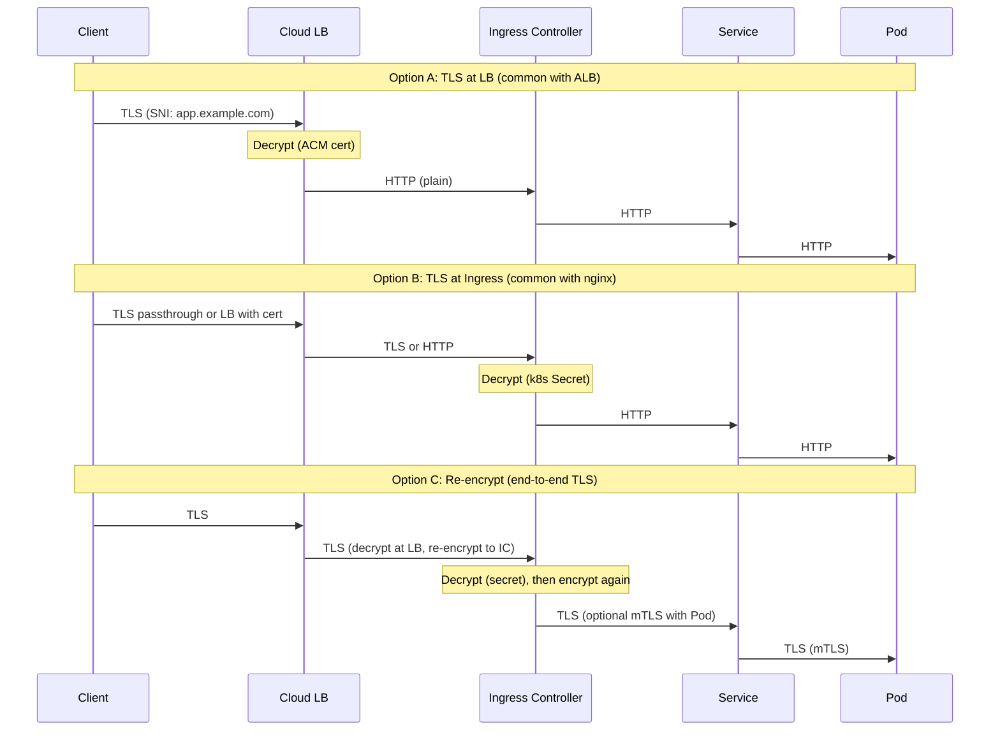

## Step 8: NetworkPolicies — Pod-Level Firewall

Without policies: all Pods can talk to all Pods (flat network). NetworkPolicies restrict that.

### Default: All Allow
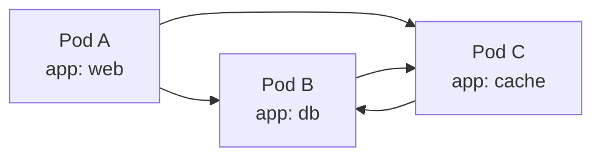

### With Default Deny + Allow Rules
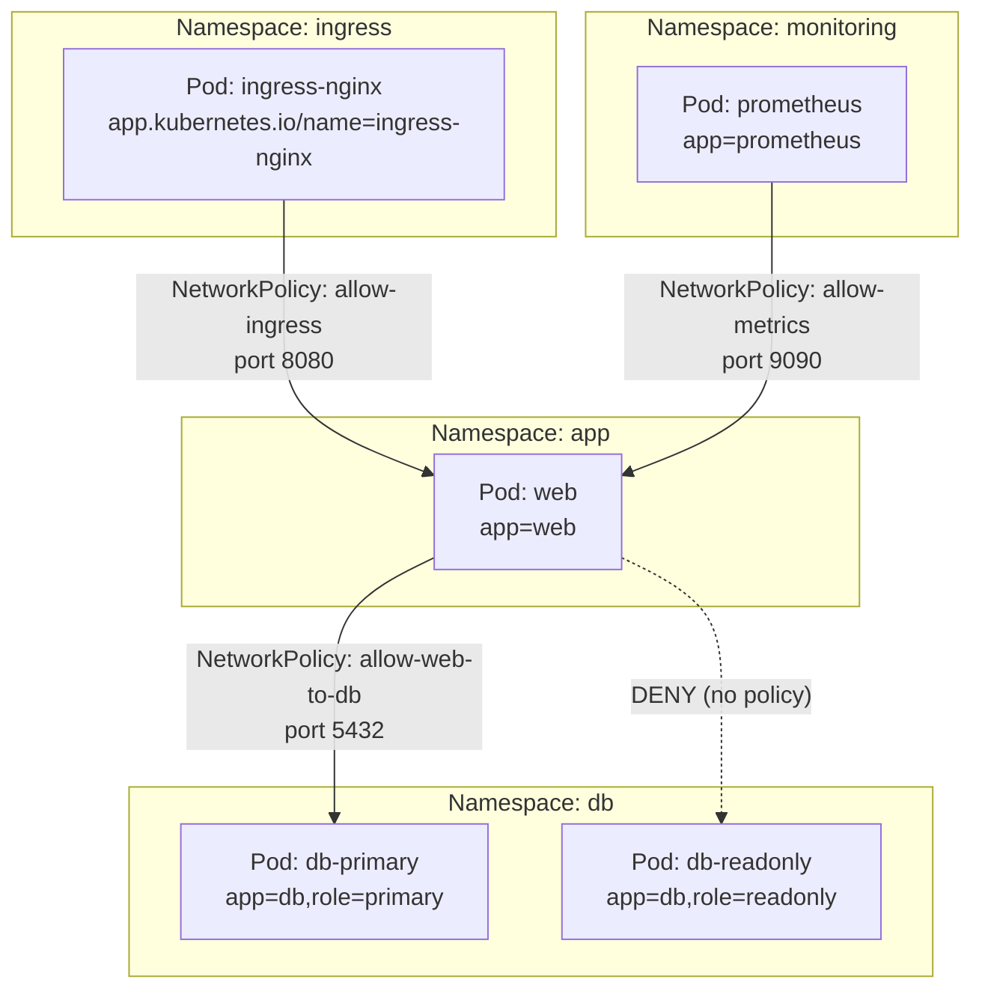

```yaml
# Default deny all ingress
apiVersion: networking.k8s.io/v1
kind: NetworkPolicy
metadata:
  name: default-deny-ingress
  namespace: app
spec:
  podSelector: {}
  policyTypes:
    - Ingress
---
# Allow from ingress controller
apiVersion: networking.k8s.io/v1
kind: NetworkPolicy
metadata:
  name: allow-from-ingress
  namespace: app
spec:
  podSelector:
    matchLabels:
      app: web
  policyTypes:
    - Ingress
  ingress:
    - from:
        - namespaceSelector:
            matchLabels:
              kubernetes.io/metadata.name: ingress-nginx
          podSelector:
            matchLabels:
              app.kubernetes.io/name: ingress-nginx
      ports:
        - port: 8080
---
# Allow web → db-primary only
apiVersion: networking.k8s.io/v1
kind: NetworkPolicy
metadata:
  name: allow-web-to-db
  namespace: db
spec:
  podSelector:
    matchLabels:
      role: primary
  policyTypes:
    - Ingress
  ingress:
    - from:
        - namespaceSelector:
            matchLabels:
              kubernetes.io/metadata.name: app
          podSelector:
            matchLabels:
              app: web
      ports:
        - port: 5432
---
# Allow prometheus → web metrics
apiVersion: networking.k8s.io/v1
kind: NetworkPolicy
metadata:
  name: allow-metrics
  namespace: app
spec:
  podSelector:
    matchLabels:
      app: web
  policyTypes:
    - Ingress
  ingress:
    - from:
        - namespaceSelector:
            matchLabels:
              kubernetes.io/metadata.name: monitoring
          podSelector:
            matchLabels:
              app: prometheus
      ports:
        - port: 9090
```

## Step 9: Full Production Flow

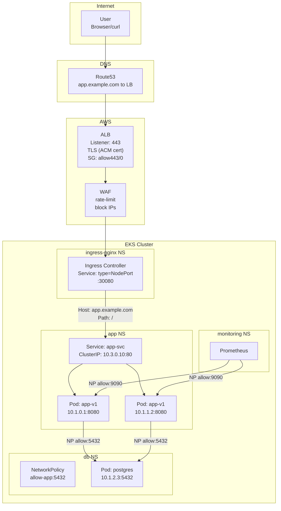

## Step 10: Service Type Decision Tree

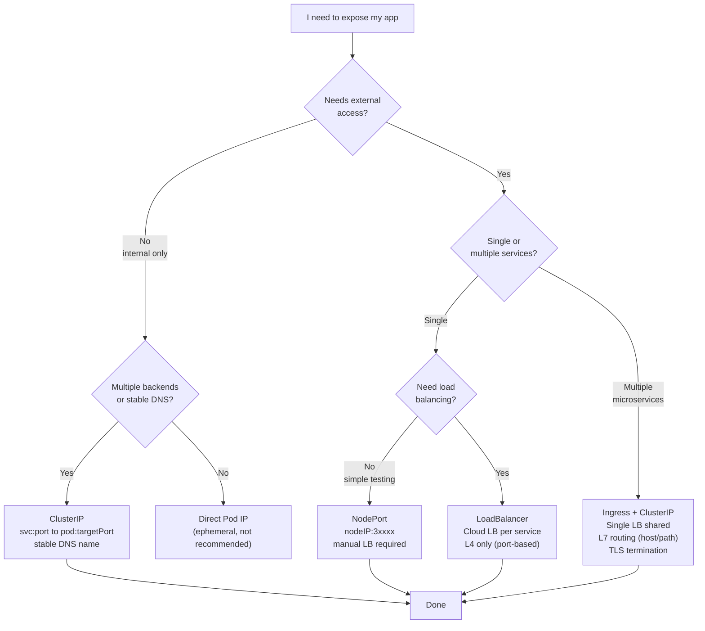

## Full Comparison Table

| Step | Resource | External Access | LB | L7 | TLS | Use Case |
|------|----------|:---------------:|:--:|:--:|:---:|----------|
| 0 | Pod | ✗ | ✗ | ✗ | ✗ | Container runtime unit |
| 1-2 | Pod IP | ✗ | ✗ | ✗ | ✗ | Internal only (ephemeral) |
| 3 | ClusterIP | ✗ | ✔ | ✗ | ✗ | Microservice-to-microservice |
| 4 | NodePort | ✔ (nodeIP:port) | ✗ | ✗ | ✗ | Debug, bare-metal |
| 5 | LoadBalancer | ✔ (LB DNS) | ✔ | ✗ | ✔ (at LB) | Single service, simple |
| 6+ | Ingress | ✔ (hostname) | ✔ | ✔ | ✔ (IC) | Multi-service, routing needed |
| 8 | NetworkPolicy | controls access | ✗ | ✗ | ✗ | Pod-level firewall |
